# Relatorio Tecnico do Backend e Impacto no Frontend

## Escopo

Este documento descreve:

- a arquitetura atual do backend
- os fluxos principais da API
- os modulos e funcoes de negocio
- a evolucao recente de autenticacao, repositorio, ACL, observabilidade e jobs assincronos
- o estado atual do frontend em relacao a esse backend
- o gap entre o que ja existe no servidor e o que a interface ainda nao consome

## Visao Executiva

O backend hoje ja opera como um nucleo de repositorio autenticado com:

- autenticacao com login, MFA, refresh rotativo e logout global
- repositorio de pacotes zip com metadata, checksum, deduplicacao e workflow formal
- compartilhamento por usuario e por time
- API publica de catalogo e releases
- observabilidade por request
- jobs assincronos para scan e publish
- trilha de auditoria

O frontend ja saiu do modo "MVP visual" e hoje opera uma camada funcional relevante da plataforma:

- auth com sessao completa no cliente
- refresh com fila para evitar renovacoes concorrentes
- console separado por dominio
- repositório com rota dedicada e deep-link por projeto
- modais estruturados para metadata, workflow e grants
- times com convites, membros e grants por equipe
- operações com jobs e metricas
- catalogo publico
- toasts globais, pagination, empty states e states de loading
- testes unitarios, de componente e scaffold de E2E

Em termos práticos: o backend ainda continua mais maduro no dominio, mas o frontend agora representa de forma bem mais fiel a plataforma real.

---

## 1. Arquitetura Geral

### Camadas

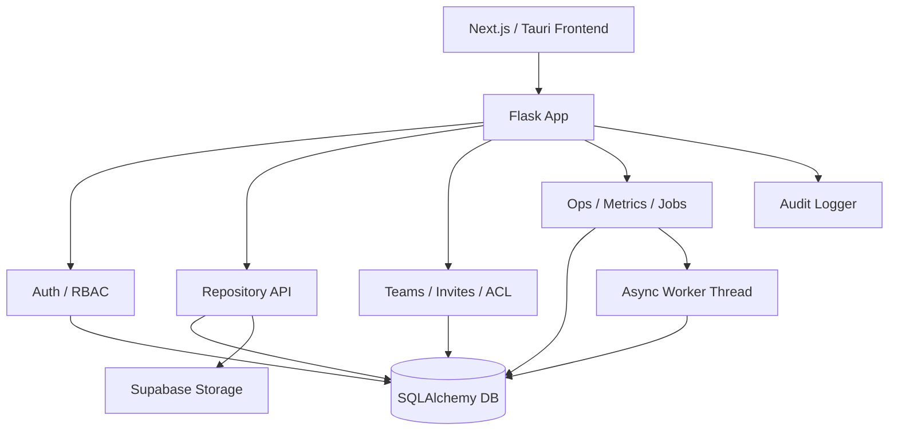

### Pontos principais do backend

- App Flask central em [app.py](/home/zeus/Documentos/camellia-shield/app.py)
- Auth API em [api/auth.py](/home/zeus/Documentos/camellia-shield/api/auth.py)
- Repository API em [api/projects.py](/home/zeus/Documentos/camellia-shield/api/projects.py)
- Access API em [api/access.py](/home/zeus/Documentos/camellia-shield/api/access.py)
- Ops API em [api/ops.py](/home/zeus/Documentos/camellia-shield/api/ops.py)
- Persistencia IAM em [core/iam/models.py](/home/zeus/Documentos/camellia-shield/core/iam/models.py) e [core/iam/db.py](/home/zeus/Documentos/camellia-shield/core/iam/db.py)
- Jobs em [core/async_jobs.py](/home/zeus/Documentos/camellia-shield/core/async_jobs.py)
- Observabilidade em [core/observability.py](/home/zeus/Documentos/camellia-shield/core/observability.py)
- Cliente frontend em [frontend/src/lib/api.ts](/home/zeus/Documentos/camellia-shield/frontend/src/lib/api.ts)

---

## 2. Dominio de Dados

### Principais entidades

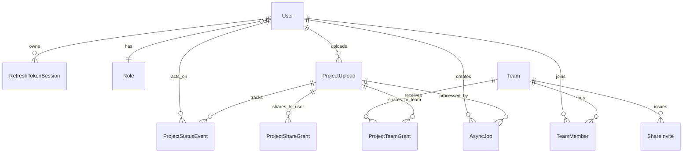

### Entidades e responsabilidade

- `User`: identidade, senha, MFA, role.
- `Role`: perfil `owner` ou `user`.
- `RefreshTokenSession`: sessao persistida do refresh token, com revogacao e rotacao.
- `ProjectUpload`: artefato principal do repositorio.
- `ProjectStatusEvent`: historico formal de transicoes.
- `ProjectShareGrant`: grant direto para usuario.
- `ProjectTeamGrant`: grant para time.
- `Team`: agrupador de usuarios.
- `TeamMember`: membership e papel dentro do time.
- `ShareInvite`: convite de entrada no time.
- `AsyncJob`: scan e publish em background.

---

## 3. Fluxos do Backend

## 3.1 Autenticacao

### Fluxo de login

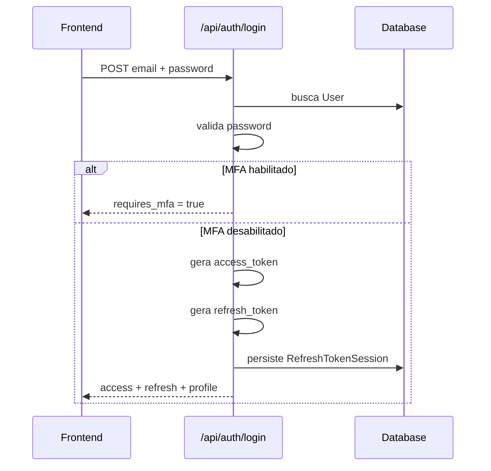

### Fluxo de refresh rotativo

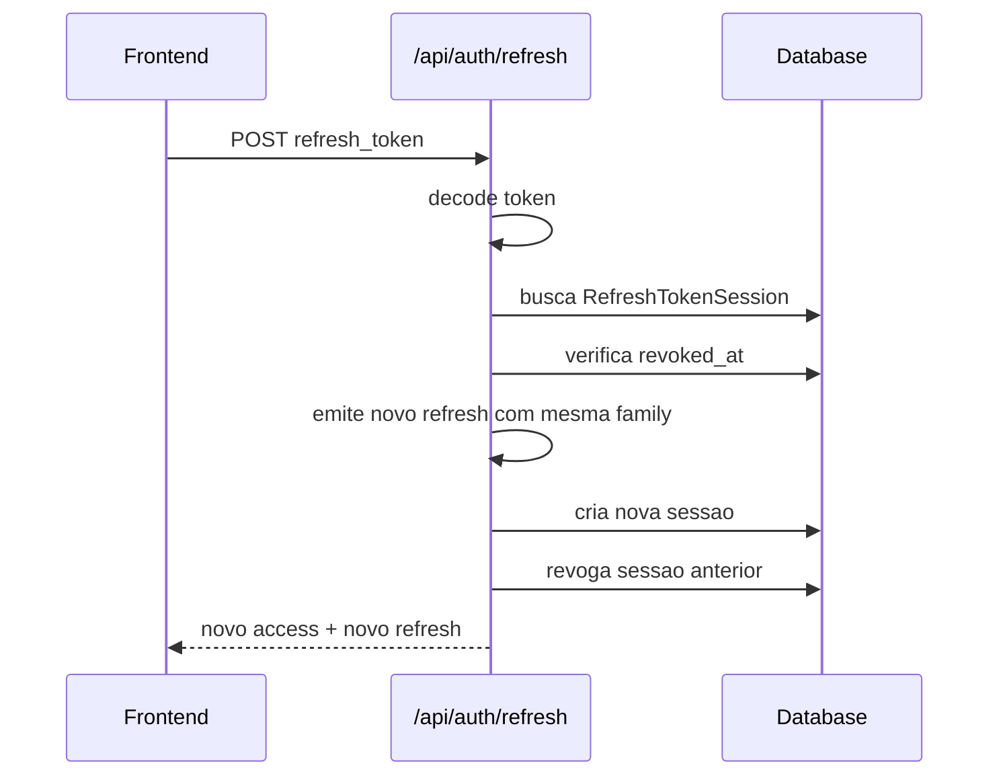

### Funcoes existentes

- `login`
- `login_mfa`
- `logout`
- `logout_all`
- `refresh_token`
- `register`
- `status`
- setup, verify e disable de MFA

### Estado tecnico

O backend suporta sessao de longo prazo e o frontend agora acompanha bem melhor esse modelo. A store em [auth.ts](/home/zeus/Documentos/camellia-shield/frontend/src/store/auth.ts) guarda `accessToken`, `refreshToken`, `role` e `user_id`, e o cliente em [api.ts](/home/zeus/Documentos/camellia-shield/frontend/src/lib/api.ts) faz refresh silencioso com fila compartilhada para evitar corridas de renovacao.

---

## 3.2 Upload e catalogacao de pacote

### Fluxo de upload

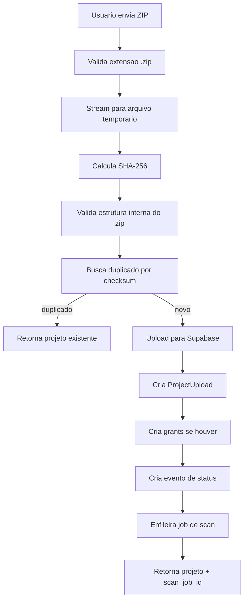

### Validacoes do artefato

- limite de upload
- limite de entradas no zip
- limite de tamanho descompactado
- bloqueio de extensoes perigosas
- bloqueio de path traversal
- bloqueio de profundidade excessiva
- checksum SHA-256
- deduplicacao por checksum

### Estado inicial do pacote

- `owner`: upload entra como `approved`
- `user`: upload entra como `draft`

---

## 3.3 Workflow do repositorio

### Estados suportados

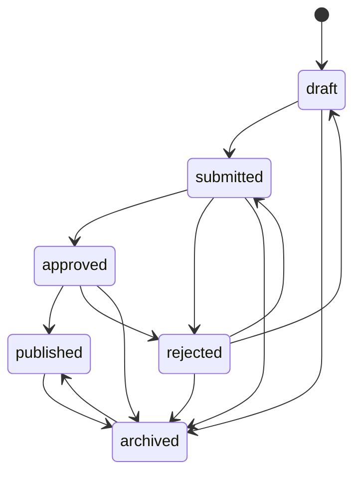

### Regras principais

- apenas `owner` publica release
- apenas pacote `public` pode ser publicado
- nao pode haver `package_name + package_version` duplicado ja publicado
- ao publicar, o backend recalcula `is_latest` por semver
- todas as transicoes relevantes viram `ProjectStatusEvent`

### Endpoints centrais

- `POST /api/projects/upload`
- `GET /api/projects/list`
- `GET /api/projects/<id>`
- `PATCH /api/projects/<id>`
- `DELETE /api/projects/<id>`
- `GET /api/projects/<id>/download`
- `GET /api/projects/<id>/history`
- `GET /api/projects/package/<package_name>/versions`

---

## 3.4 Compartilhamento e ACL

### Modelo de permissao

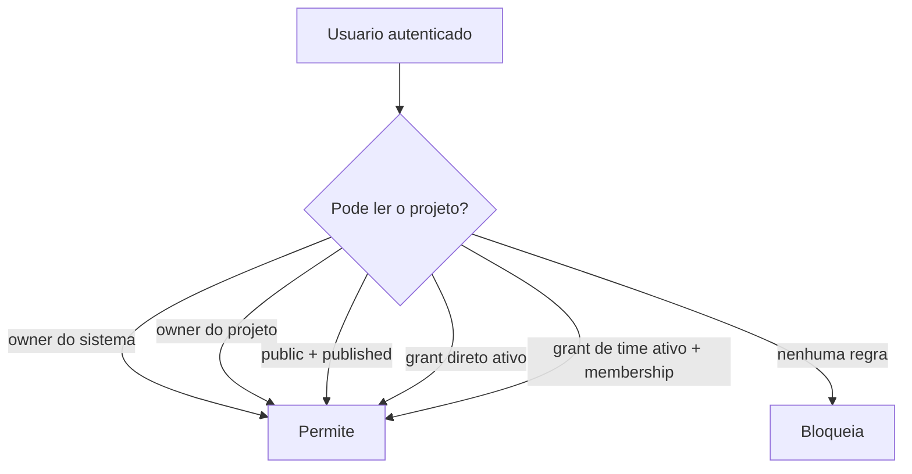

### Modos de acesso

- `private`
- `public`
- `shared`

### Mecanismos de grant

- `share_grants`: grants por usuario
- `team_grants`: grants por time
- convites para composicao do time

### Access API

- `GET /api/access/teams`
- `POST /api/access/teams`
- `POST /api/access/teams/<team_id>/invites`
- `POST /api/access/invites/<token>/accept`
- `POST /api/access/projects/<project_id>/team-grants`

---

## 3.5 API publica de distribuicao

### Fluxo publico

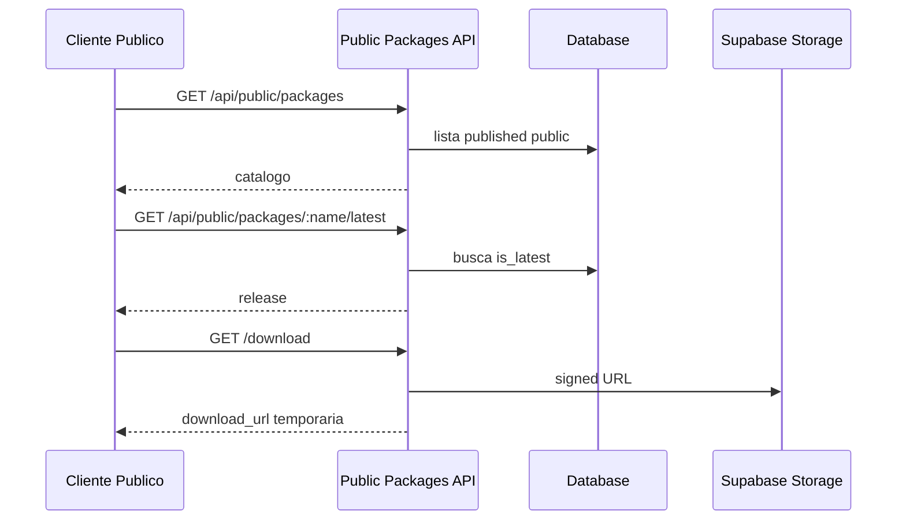

### Endpoints publicos

- `GET /api/public/packages`
- `GET /api/public/packages/<package_name>`
- `GET /api/public/packages/<package_name>/latest`
- `GET /api/public/packages/<package_name>/versions/<package_version>`
- `GET /api/public/packages/<package_name>/versions/<package_version>/download`

---

## 3.6 Jobs assincronos

### Pipeline atual

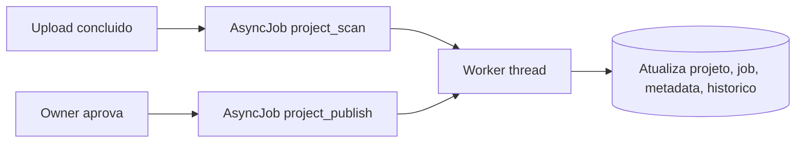

### Tipos de job

- `project_scan`
- `project_publish`

### O que ja acontece

- upload gera `scan_job_id`
- job de scan atualiza metadata de scan
- publish assíncrono muda status e recalcula `latest`
- Jobs podem ser consultados pela Ops API

### Endpoints de operacao

- `GET /api/ops/jobs`
- `GET /api/ops/jobs/<id>`
- `POST /api/ops/projects/<project_id>/scan`
- `POST /api/ops/projects/<project_id>/publish`

---

## 3.7 Observabilidade

### Instrumentacao

Cada request recebe:

- `X-Request-Id`
- `X-Response-Time-Ms`

E o backend agrega:

- contagem por rota e status
- latencia media e maxima por rota
- request id nos logs JSON

### Endpoint operacional

- `GET /api/ops/metrics`

---

## 4. Mapa Funcional do Backend

### Matriz de capacidades

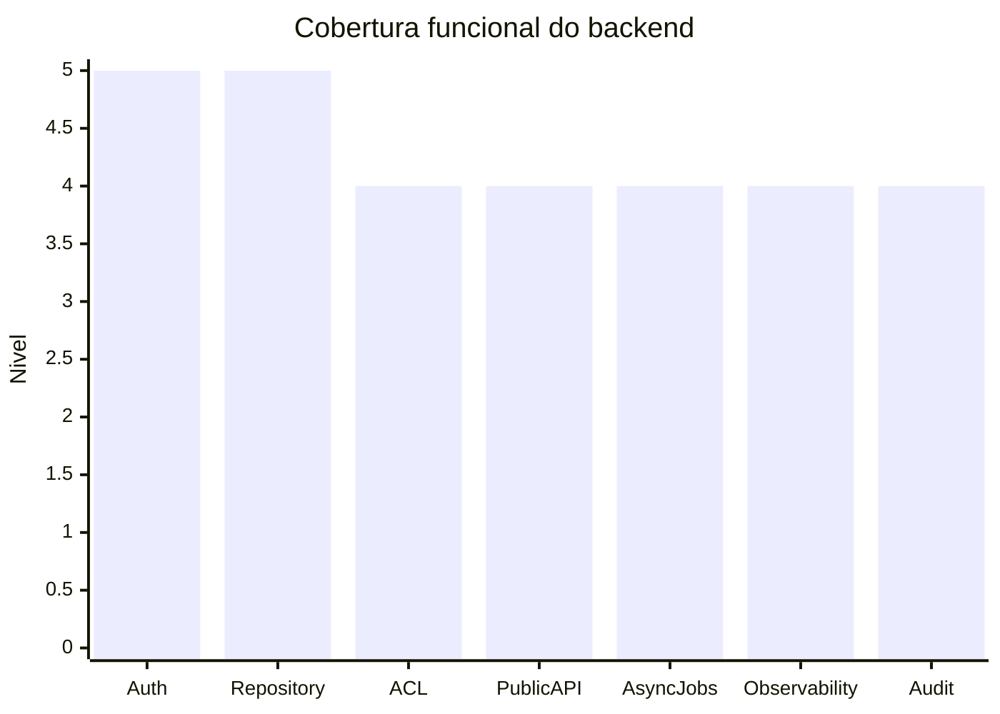

Leitura:

- `5`: maduro dentro do escopo atual
- `4`: bem funcional, mas ainda expansivel

### O que esta forte hoje

- autenticacao
- gestao de release
- versionamento basico + latest
- compartilhamento por usuario
- compartilhamento por time
- API publica
- auditoria

### O que ainda pode crescer

- malware scan real
- fila externa em vez de thread local
- convites por equipe com mais granularidade
- dashboard operacional visual
- migracoes Alembic completas alem do baseline

---

## 5. Como o Frontend fica com esse backend

## 5.1 Estado atual do frontend

Hoje a interface usa principalmente:

- [frontend/src/lib/api.ts](/home/zeus/Documentos/camellia-shield/frontend/src/lib/api.ts)
- [frontend/src/lib/types.ts](/home/zeus/Documentos/camellia-shield/frontend/src/lib/types.ts)
- [frontend/src/store/auth.ts](/home/zeus/Documentos/camellia-shield/frontend/src/store/auth.ts)
- [frontend/src/store/toast.ts](/home/zeus/Documentos/camellia-shield/frontend/src/store/toast.ts)
- [frontend/src/app/(app)/layout.tsx](/home/zeus/Documentos/camellia-shield/frontend/src/app/(app)/layout.tsx)
- [frontend/src/components/features/ProjectUploader.tsx](/home/zeus/Documentos/camellia-shield/frontend/src/components/features/ProjectUploader.tsx)
- [frontend/src/components/features/RepositoryControlCenter.tsx](/home/zeus/Documentos/camellia-shield/frontend/src/components/features/RepositoryControlCenter.tsx)
- [frontend/src/components/features/TeamsPanel.tsx](/home/zeus/Documentos/camellia-shield/frontend/src/components/features/TeamsPanel.tsx)
- [frontend/src/components/features/OpsPanel.tsx](/home/zeus/Documentos/camellia-shield/frontend/src/components/features/OpsPanel.tsx)
- [frontend/src/components/features/PublicCatalogPanel.tsx](/home/zeus/Documentos/camellia-shield/frontend/src/components/features/PublicCatalogPanel.tsx)
- [frontend/src/components/features/StatsBar.tsx](/home/zeus/Documentos/camellia-shield/frontend/src/components/features/StatsBar.tsx)
- [frontend/src/components/features/AuditLogPanel.tsx](/home/zeus/Documentos/camellia-shield/frontend/src/components/features/AuditLogPanel.tsx)
- [frontend/src/app/(app)/dashboard/page.tsx](/home/zeus/Documentos/camellia-shield/frontend/src/app/(app)/dashboard/page.tsx)
- [frontend/src/app/(app)/repository/page.tsx](/home/zeus/Documentos/camellia-shield/frontend/src/app/(app)/repository/page.tsx)
- [frontend/src/app/(app)/repository/[projectId]/page.tsx](/home/zeus/Documentos/camellia-shield/frontend/src/app/(app)/repository/[projectId]/page.tsx)
- [frontend/src/app/(app)/teams/page.tsx](/home/zeus/Documentos/camellia-shield/frontend/src/app/(app)/teams/page.tsx)
- [frontend/src/app/(app)/ops/page.tsx](/home/zeus/Documentos/camellia-shield/frontend/src/app/(app)/ops/page.tsx)
- [frontend/src/app/(app)/catalog/page.tsx](/home/zeus/Documentos/camellia-shield/frontend/src/app/(app)/catalog/page.tsx)
- [frontend/src/app/(app)/settings/page.tsx](/home/zeus/Documentos/camellia-shield/frontend/src/app/(app)/settings/page.tsx)

### O que ele faz de fato

- login e registro
- MFA
- status da sessao
- logout
- logout global
- refresh silencioso com fila
- upload com metadata, versao e visibilidade
- listagem paginada de projetos
- detalhe profundo do projeto por rota
- historico de status
- workflow visual
- edicao de metadata
- grants por usuario com expiracao
- grants por time
- times, membros e convites
- jobs assincronos por projeto
- metricas operacionais
- catalogo publico com paginação
- download assinado interno e publico
- leitura contextual do log de auditoria
- toasts globais
- badge de status do desktop

### O que ele ainda nao consome

- listagem administrativa global com `scope=all`
- filtros de `checksum_sha256`, `user_id`, `sort_by` e `sort_dir` ainda sem cobertura total na UI
- signed URL com expiracao customizada exposta ao usuario
- gerenciamento fino de grants por time com expiracao na UI
- remocao/edicao de membros de time
- dashboard operacional com agregacoes mais analiticas
- fluxo E2E completo automatizado rodando no CI

---

## 5.2 Gap estrutural entre backend e frontend

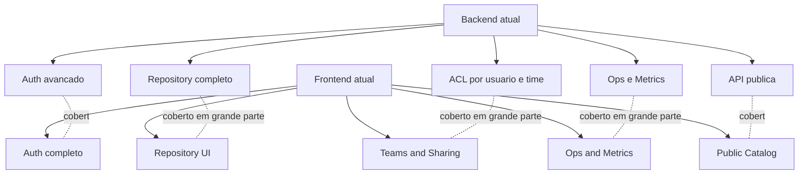

Diagnostico direto:

- o frontend agora representa boa parte do produto real
- os contratos do cliente estao alinhados ao backend atual
- a store de auth modela sessao completa
- o principal gap restante esta mais em acabamento de UX, analytics e automacao de testes do que em cobertura funcional

---

## 5.3 Como o frontend foi reorganizado

### Nova arquitetura em producao local

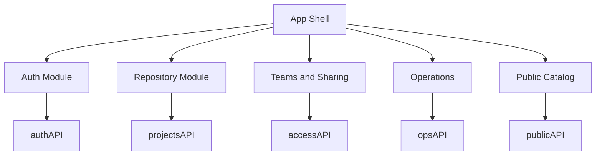

### Rotas implementadas

1. `/dashboard`
   - overview da plataforma
   - acesso rapido aos dominios

2. `/repository`
   - upload
   - listagem paginada
   - filtros persistidos na URL

3. `/repository/[projectId]`
   - detalhe profundo do release
   - historico
   - workflow
   - jobs ligados ao projeto
   - auditoria contextual

4. `/teams`
   - times
   - membros
   - convites
   - grants por equipe

5. `/ops`
   - fila de jobs
   - scans e publish assíncrono
   - metricas por rota

6. `/catalog`
   - catálogo publico
   - versoes
   - latest
   - download público

---

## 5.4 Contratos do frontend ja atualizados

### Tipos

O frontend agora modela as entidades principais em [frontend/src/lib/types.ts](/home/zeus/Documentos/camellia-shield/frontend/src/lib/types.ts):

- `package_name`
- `package_version`
- `description`
- `changelog`
- `checksum_sha256`
- `visibility`
- `lifecycle_status`
- `status_reason`
- `is_latest`
- `metadata`
- `duplicate_of_id`
- `download_count`
- `reviewed_by`
- `reviewed_at`
- `submitted_at`
- `approved_at`
- `published_at`
- `archived_at`
- `rejected_at`
- `share_grants`
- `team_grants`
- `AsyncJob`
- `Team`
- `TeamInvite`
- `MetricsSnapshot`
- respostas de catálogo publico

### Cliente API

O modulo [frontend/src/lib/api.ts](/home/zeus/Documentos/camellia-shield/frontend/src/lib/api.ts) hoje já expõe:

- `authAPI.refresh`
- `authAPI.logoutAll`
- `projectsAPI.get`
- `projectsAPI.update`
- `projectsAPI.remove`
- `projectsAPI.download`
- `projectsAPI.history`
- `projectsAPI.versionMatrix`
- `accessAPI`
- `opsAPI`
- `publicPackagesAPI`

Além disso:

- faz refresh silencioso
- serializa queries
- usa fila para refresh concorrente
- trata timeout e retry
- suporta multipart para upload

### Store de autenticacao

A store em [frontend/src/store/auth.ts](/home/zeus/Documentos/camellia-shield/frontend/src/store/auth.ts) já modela:

- `accessToken`
- `refreshToken`
- `role`
- `userId`
- sessao persistida
- atualizacao de access token
- logout local

---

## 6. Fluxo atual do frontend apos essa evolucao

## 6.1 Fluxo de sessao

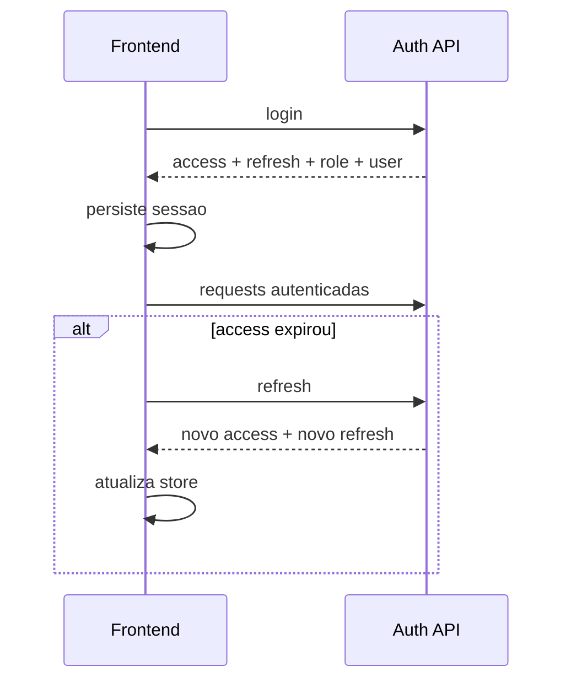

## 6.2 Fluxo de publicacao

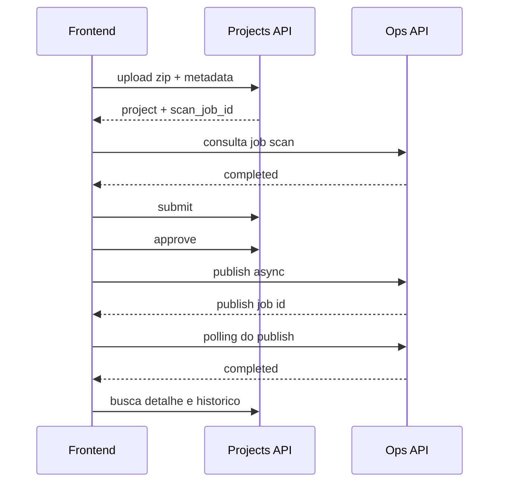

## 6.3 Fluxo de compartilhamento por time

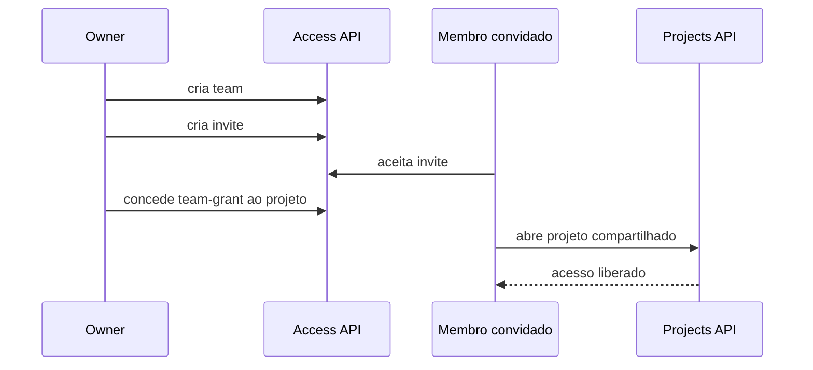

---

## 6.4 Fluxo de deep-link do projeto

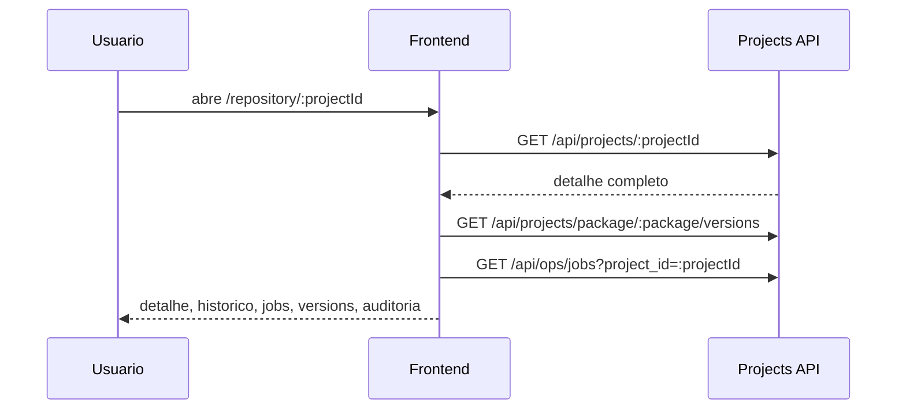

## 6.5 Fluxo de feedback global

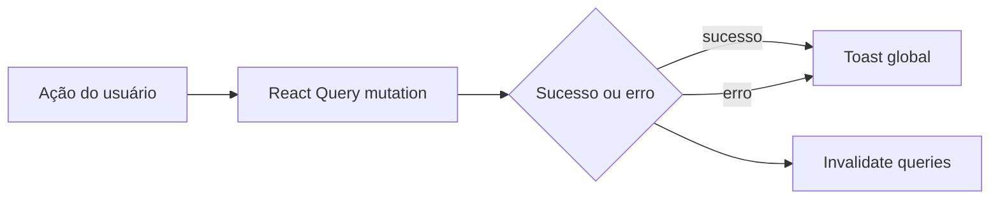

---

## 7. Testes e Qualidade do Frontend

### Testes implementados

- unit tests em [ui.test.ts](/home/zeus/Documentos/camellia-shield/frontend/src/lib/ui.test.ts)
- store tests em [auth.test.ts](/home/zeus/Documentos/camellia-shield/frontend/src/store/auth.test.ts)
- API client tests em [api.test.ts](/home/zeus/Documentos/camellia-shield/frontend/src/lib/api.test.ts)
- component/page tests em [page.test.tsx](/home/zeus/Documentos/camellia-shield/frontend/src/app/login/page.test.tsx)

### E2E scaffold

- Playwright configurado em [playwright.config.ts](/home/zeus/Documentos/camellia-shield/frontend/playwright.config.ts)
- primeiro teste em [auth.spec.ts](/home/zeus/Documentos/camellia-shield/frontend/tests/e2e/auth.spec.ts)

### Scripts

- `npm test`
- `npm run test:e2e`
- `npm run type-check`

---

## 8. Leitura final: estado do produto

### Backend

O backend ja tem perfil de plataforma:

- dominios de auth, repositorio, ACL, distribuicao e operacao
- regra de negocio real
- modelo de dados coerente
- trilha operacional
- base para escalar

### Frontend

O frontend agora tem perfil de console funcional de plataforma:

- auth completo com sessao persistida
- domínios separados por rota
- detalhe profundo de release
- ACL e sharing operacionais
- jobs e metricas visiveis
- catálogo público utilizável
- base de testes já iniciada

### Conclusao objetiva

Com tudo isso, o frontend ja foi promovido a cliente de plataforma. O servidor oferece estrutura para:

- portal interno de repositorio
- catalogo publico de releases
- console operacional
- painel de times e grants
- fluxo editorial de submissao e aprovacao

Hoje a interface já cobre boa parte desse produto. O que falta agora e, sobretudo:

- acabamento de UX
- cobertura de testes mais ampla
- analytics visuais melhores
- E2E real dos fluxos críticos

---

## 9. Proxima etapa recomendada

Se a proxima fase for de implementacao, a ordem mais eficiente agora e:

1. ampliar E2E para login real, repository, workflow e teams
2. endurecer a11y e mobile nos modais, tabelas e sidebars
3. adicionar analytics visuais melhores no dashboard e ops
4. cobrir `scope=all`, filtros administrativos e cenários de owner
5. ligar testes de frontend ao CI

Se a proxima fase for de produto, o desenho final da experiencia deveria ficar assim:

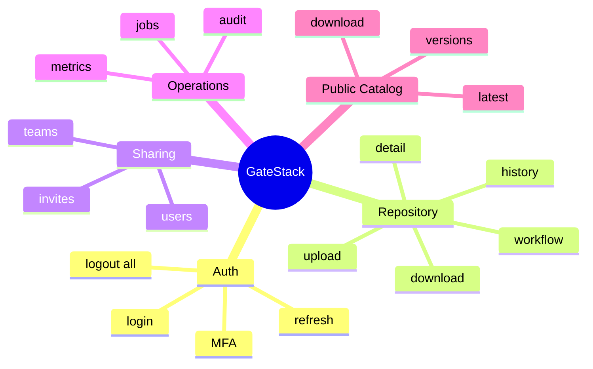
